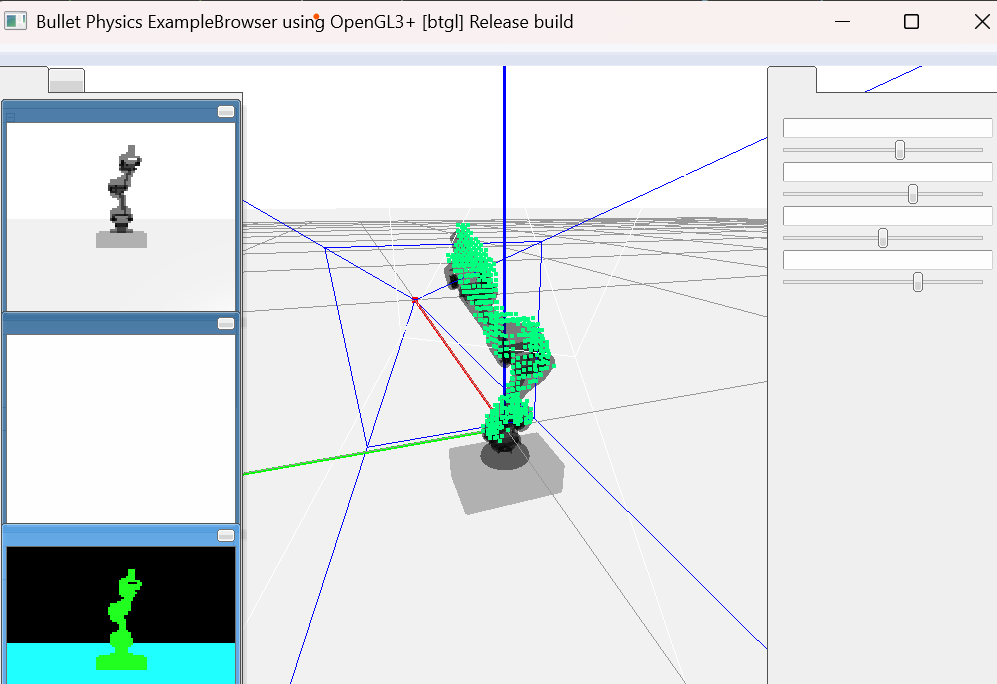

# Teaching Robots to Build Simulations of Themselves


Robots can learn their physical form and movement autonomously through vision alone! Previous robots relied on math, sensors, or engineers to define their bodies and controllers. Now, a robot can "figure itself out" in minutes, adapt to damage (like a bent arm), and even plan complex tasks — all by watching its own movements in a "mirror" (a regular camera).

> "We humans cannot afford to constantly baby these robots, repair broken parts, and adjust performance. Robots need to learn to take care of themselves if they are going to become truly useful. That’s why self-modeling is so important. 
"  
> – *Hod Lipson*
>
> **Note**
> For an in-depth exploration of this topic, [read more](https://www.engineering.columbia.edu/about/news/robots-learn-how-move-watching-themselves-0) in the Columbia Engineering article.


---

## Table of Contents

- [Overview](#overview)
- [Key Features](#key-features)
- [Environment Setup](#environment-setup)
- [Demo and Expected Output](#demo-and-expected-output)
- [Training and Reproduction](#training-and-reproduction)
- [Citation and References](#citation-and-references)
- [License](#license)
- [Contact](#contact)
---
## Overview

SelfSimRobot transforms traditional robotics by allowing a machine to learn its own structure directly from visual data. Instead of relying on detailed mathematical models and handcrafted kinematic equations, our system uses a single RGB camera to capture raw video. The data is processed to form a self-model that:
- **Predicts 3D Occupancy:** Through FFKSM, the robot estimates its own body structure in 3D space.
- **Plans Complex Motions:** Using gradient-based optimization, the robot generates motor commands for intricate 3D trajectories.
- **Adapts to Damage:** The model can detect abnormalities and adjust to physical changes in real time.

(See **Figure 1** for a pipeline overview, **Figure 2** for morphology predictions, and **Figure 3** for motion planning demonstrations.)

---

## Key Features

- **Visual Self-Modelling:** Learn your own body from video—just like looking in a mirror.
- **Efficient Architecture:** FFKSM efficiently encodes spatial coordinates and joint angles into accurate 3D predictions.
- **Motion Planning Without Explicit Kinematics:** Plan complex paths without manually defined equations.
- **Resilient and Adaptive:** Detect and recover from damage with minimal intervention.
- **Lightweight & Fast:** Designed to run efficiently even on modest hardware.

---

## Environment Setup

Once Python is installed, you will need to install the project dependencies. Clone this repository to your local machine, navigate to the cloned directory, and run the following command:

```bash
pip install -r requirements.txt
```

This command installs all the necessary Python packages listed in the requirements.txt file.


## Demo and Expected Output

```bash
python visualize_bullet.py
```

When you run the visualize_bullet.py script, a GUI window displays a robot body and the model prediction. Here's what you can expect to see in the simulation:



##### Robot Arm 3D Model:
A transparent 3D model of a robot arm will be visible in the center of the simulation environment. This model represents the physical structure of the robot being simulated.

##### Prediction Points: 
Green dots will appear around the robot arm model. These dots represent the real-time predictions generated by the FFKSM. They indicate the predicted positions of the robot's end effector or entire body.

##### Action Command Bars:
On the left side of the GUI, there are four bars that you can interact with. These bars allow you to modify the action commands sent to the robot. Adjusting these bars changes the robot's actions within the simulation, demonstrating how the system responds to different command inputs.

## Training and Reproduction:
We have provided pre-trained models to help you get started without the need to train the models from scratch. These models are located in the trained_model folder. The visualize_bullet.py script automatically uses these models to run the simulations.

To train a model from scratch, you can use the data in supplementary materials and use train.py to train the model by yourself.

## Citation and References
If you find our work useful and insightful, thank you for citing our work:
Teaching Robots to Build Simulations of Themselves


## License
This project is open source and available under the MIT License.

## Contact
For questions or further collaboration, please reach out to us:

Yuhang Hu: yuhang.hu@columbia.edu
Hod Lipson: hod.lipson@columbia.edu
